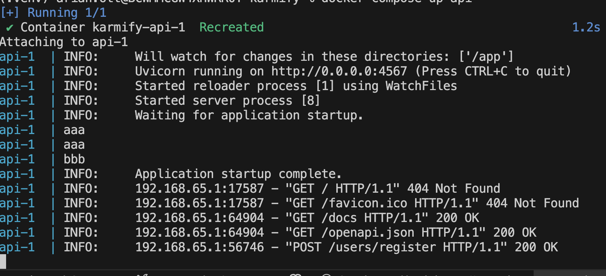

# Karmify


## Building the API:

- Provide a `.env` file

```env
DEBUG=False
MYSQL_HOST=example.com
MYSQL_USER=karmify
MYSQL_PASSWORD=Karmify
```

The MySQL host must either match the hostname of the mariadb from the docker container **or** of an actual running instance.

## Building from source

0. Start your docker engine
1. Run `docker compose build` for building the image
2. Confirm the build using `docker compose up`

The terminal should look like:



Once this is verified, stop the container using `CTRL+C` (On Windows/UNIX) or `⌘+c` on mac.

